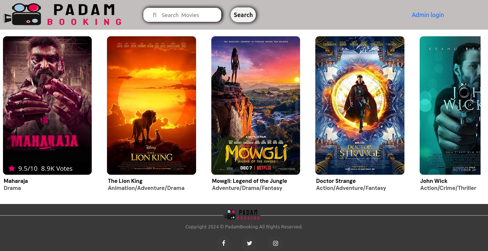
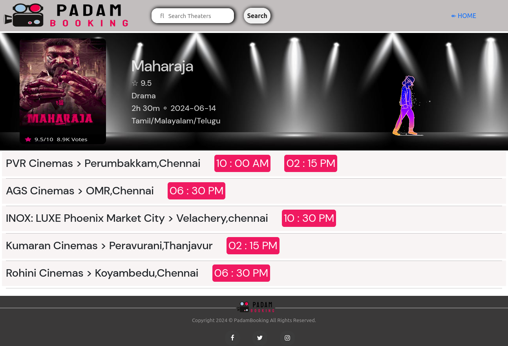
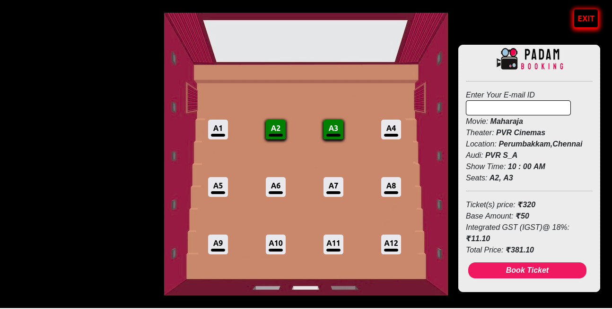
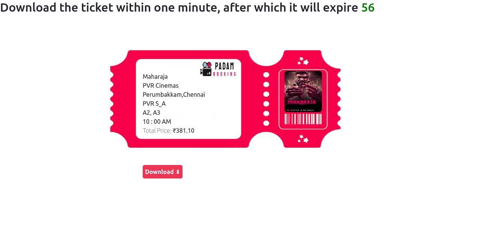

# Padam Booking

<h1>PadamBooking</h1>

PadamBooking is a full-stack movie ticket booking application that allows users to browse movies, select seats, and book tickets online. The project is built using modern technologies to provide a seamless and responsive user experience.

<h1>Tech Stack</h1>
<h2>Frontend:</h2>

<b>React.js:</b> A popular JavaScript library for building dynamic and interactive user interfaces.

<b>CSS/Bootstrap:</b> For styling and responsive design.

<h2>Backend:<h2>

<b>Spring Boot:</b> A powerful Java framework that simplifies the development of RESTful APIs.

<b>Java:</b> Core programming language for the backend logic.

<b>MySQL:</b> Relational database used to store user data, movie details, and booking information.

<h2>Features</h2>

<b>Browse Movies:</b> Users can view a list of currently available movies with details.

<b>Search and Filter:</b> Search for movies based on different filters like genre, language, etc.

<b>Seat Selection:</b> Interactive seat selection interface where users can choose seats.

<b>Real-Time Availability:</b> Shows the availability of seats in real-time.

<b>User Authentication:</b> Login and registration system for users.

<b>Booking Confirmation:</b> After selecting a seat, users can confirm their bookings.

<b>Payment Integration:</b> (Optional: Mention if you have implemented or plan to implement payment gateway integration.)

<h2>Installation and Setup</h2>
<h3>Prerequisites:</h3>

Node.js (for running React frontend)

Java and Spring Boot (for backend)

MySQL (for database)

<h2>Steps:</h2>
<h3>Clone the repository:</h3>

<b>git clone</b> <a>https://github.com/vibinkumar24/PadamBooking/tree/test</a>

<h2>Backend Setup:</h2>

Navigate to the backend directory.

Ensure you have Java and Spring Boot installed.

Configure the MySQL database connection in application.properties.

Run the Spring Boot application:

<b>mvn spring-boot:run</b>

<h2>Frontend Setup:</h2>

Navigate to the frontend directory.

Install dependencies:

<b>npm install</b>

Start the React application:

<b>npm start</b>
<h2>Access the Application:</h2>

The frontend will be available at <b>http://localhost:3000/.</b>

The backend API will run on <b>http://localhost:8080/.</b>

<h2>Database Structure</h2>
<h3>Tables:</h3>

<b>movies:</b> Stores movie details.

<b>theaters:</b> Stores theaters details.

<b>screen:</b> Stores screen details.

<b>seat:</b> Stores seat details.

<b>show:</b> Stores show details.

<b>bookings:</b> Stores user booking details.

<b>users:</b> Stores user information for authentication.

<h2>Future Enhancements</h2>

<b>Payment Integration:</b> Plan to integrate payment gateways for real-time payments.

<b>Admin Dashboard:</b> Add an admin panel for managing movies and bookings.

<b>Improved UI/UX:</b> Further enhancements in user interface and experience.

